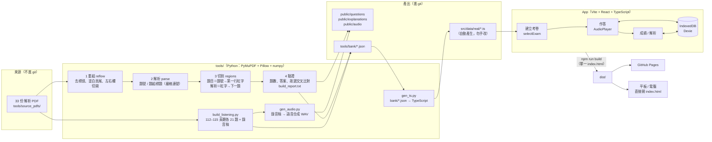

# 國中教育會考 練習 App

給**我自己的小孩**在家練習會考用的小工具：從歷屆會考解析卷整理出題庫，在平板或電腦的瀏覽器上選科目、年度、時間作答，交卷後看正解與每題解析。

> **特別說明**
> - 這是家長自用的練習工具，只給自己的孩子使用，不是對外提供的服務。
> - 題目、詳解截圖的版權屬原出版社所有，僅供個人／家庭練習使用，**請勿散布、轉載或做商業用途**。
> - 英聽的聲音是用錄音稿以語音合成產生，**不是會考原音**。

## 題庫來源

翰林「會考考前衝刺」下載頁：<https://www.ehanlin.com.tw/event/pre-exam/download/index.html#CAP>

只用每科的「**xxx會考xx解析.pdf**」（題本不需要），110–115 年每年 5 份，113 年起另有單獨的「xxx會考英聽解析.pdf」，共 33 份：

| 年度 | 國文 | 英文 | 英聽 | 數學 | 自然 | 社會 | 合計 |
|---|---|---|---|---|---|---|---|
| 110 | 48 | 41 | — | 26 | 54 | 63 | 232 |
| 111 | 42 | 43 | — | 25 | 50 | 54 | 214 |
| 112 | 42 | 43 | 21 | 25 | 50 | 54 | 235 |
| 113 | 42 | 43 | 21 | 25 | 50 | 54 | 235 |
| 114 | 42 | 43 | 21 | 25 | 50 | 54 | 235 |
| 115 | 42 | 43 | 21 | 25 | 50 | 54 | 235 |
| **合計** | 258 | 256 | 84 | 151 | 304 | 333 | **1386** |

- 只收選擇題：數學的非選擇題（手寫題）不收；國文解析卷沒有作文。
- 英聽：112 年收在英文解析卷前段，113 年起是單獨一份英聽解析卷；110、111 年的英文解析卷只有閱讀，沒有英聽。
- 正解一覽（人工備查用）在 [`tools/answer_keys/`](tools/answer_keys/)。
- **已與心測中心官方「選擇題參考答案一覽表」逐題比對：1386 題全部一致**（官方答案存於 [`tools/official_answers/`](tools/official_answers/)，比對程式 `tools/check_official.py`）。

## 功能

- **建立考卷**：科目（可多選）、年度（可多選）、原始順序／亂數、份量（全卷／1/2 卷／1/4 卷：每科依會考的題數與時間比例，國文·社會·自然 70 分鐘、英語閱讀 60、聽力 25、數學 80）。按「開始測驗」後會先確認選擇內容。
- **題組不拆開**：亂數出題以題組為單位，同一題組的題目一定連在一起、順序不變，分頁也不會把題組切開。
- **作答**：一次一題（題組則是整組文章＋各小題同一頁，任何情況都不拆開、依原題號排序），上一題／下一題切換；測驗中關閉或上一頁會提醒。
- **英聽**：播放／暫停、重播、拖曳進度、0.5x～1.25x 速度。
- **成績**：正確率、每題對錯、每題解析（英聽解析含錄音稿）；可刪除單筆或清除全部紀錄。
- **評級**：依心測中心每年的「各科等級加標示與答對題數對照表」（`tools/official_levels/`，由 `tools/gen_levels.py` 轉成 `src/data/levels.ts`）。全卷＋單一年度給官方等級；半卷以上依各年門檻比例估計（標「約」）；不到半卷只看正確率。英文用官方「只考閱讀」對照表，英文＋英聽同時作答另給「英語整體」；數學沒有非選擇題，以選擇題答對率估計非選擇題級分（一律標「約」）。
- **積分與等級（第一版）**：新題答對 +10、嘗試 +2、隔天以後訂正錯題 +15、同一題不同兩天都答對＝精熟 +10、重做已會的題只 +1；完成一份卷 +20、正確率 70%／90% 加成 ×1.2／×1.5、每週完成 3 份卷 +50。成績列表顯示等級、經驗條、已做過題數、精熟題數，升級時有動畫；每筆紀錄可看積分明細。
- **成績只存在本機瀏覽器（IndexedDB）**：不會上傳到網站；平板和電腦的紀錄彼此獨立，清除瀏覽器資料會一起清掉。
- **匯出／匯入紀錄**（成績列表頁）：全部考卷與作答紀錄存成一個 JSON 檔（附 App 版本與裝置資訊，方便回報問題），可用 Email／LINE 分享；在另一台裝置匯入即可查看，匯入的紀錄標示「匯入」，重複匯入不會重複。

## 架構



## 重組題庫的方式

每份解析卷都是「左右兩欄」排版，先把它**重組成一條連續的單欄內容**，再依題號切割：

1. **標頭移除**：只有第 1 頁，切掉「翰林出版 logo＋會考解析卷標題＋年班號姓名欄」。
2. **頁尾移除**：把「第 X 頁，共 X 頁」「請翻面繼續作答／請翻頁」、廣告與 QR code **塗白**（不是直接切一條線：有些頁面的頁碼和左欄最後一行字同高，用切的會切到內容）。
3. **左右欄**：每頁從中間切開，依「第1頁左 → 第1頁右 → 第2頁左 …」接成一條。重組後的 PDF 輸出到 `tools/reflowed/`（本機備查用，不進 git）。
4. **個別檔案的特殊處理**（`tools/build_bank.py` 的 `RULES`）：

   | 檔案 | 處理 |
   |---|---|
   | 110 國文 | 最後一頁右半「題型分析」刪除 |
   | 110 數學 | 最後一頁右半「參考公式」、下方「章節對應表」刪除 |
   | 110 英文 | 題組沒有「(15-16)」標題、文章是圖片 → 以【文章翻譯】位置反推題組 |
   | 111 國文、111 數學 | 最後一頁整頁刪除 |
   | 112 英文 | 前段英聽另外處理，閱讀題從「四、單一選擇題」開始 |
   | 113 英文 | 同 110 英文：文章是圖片、沒有題組標題 → 以【文章翻譯】反推題組 |
   | 113 自然 | 題組文章前沒有「請閱讀…回答」標題 → 題號前一段黑字文章（或圖）視為題組 |
   | 113 社會 | 原稿題組標題寫成「第 52 至 41 題」（範圍顛倒）→ 取到下一個標題為止（52–54） |
   | 113 數學 | 答案字母不在題號文字裡，而是另外一個紅字「C」疊在「(　)」內 → 認成答案並塗白 |
   | 115 英文 | 同 113 英文：以【文章翻譯】反推題組 |
   | 115 英聽 | 第 1 頁標題是一張圖，下緣和「第一部分」那行字重疊 2pt → 標頭不切到跨在下緣的文字 |

5. **切割**：題目＝題號到第一行**紅字**（解析一律是紅字）之前；解析＝紅字到下一題。題號旁印的答案字母會**塗白**成「(　)」，避免作答時看到答案。
   每題都檢查：有答案、題幹不含「故選／答案」、題幹要有 (A) 選項文字或圖片（防止題幹被截斷）、題號旁字母與「故選」一致。
6. **題組**：題目圖＝文章＋所有小題；110、111、113–115 每小題各有解析，112 則是整組一段「答案：(1)(C)；(2)(D)」，組內共用一張解析圖。
7. **英聽**（`tools/build_listening.py <年>`）：112 是官方格式（「一、辨識句意」、題號「1.」、紅字「答案:(C)」「錄音稿:」）；113–115 是翰林格式（「第一部分:辨識句意」、題號「( C )第1題」、紅字【聽力稿】【中譯】【試題解析】…故選【C】）。錄音稿依 W:／M:（M1、M2 也是男聲）／Anchor:（主播）／Question: 分段，去掉 [singing] 這類舞台指示後交給 `gen_audio.py` 合成語音。
8. **題目圖不含紅字**：切題目用的 PDF 副本會先把所有紅字（解析）塗白，題目圖邊緣不可能再出現解析殘影。
9. **洩漏檢查**（`tools/check_leaks.py`）：不沿用切割程式的判斷，另外到 PDF 找每題題號的「(　)」，確認題目圖上括號內是空白。
10. **官方答案比對**（`tools/check_official.py`）：心測中心每年公布的「選擇題參考答案一覽表」（<https://cap.rcpet.edu.tw/examination.html>）存在 `tools/official_answers/<年>.txt`，與題庫逐題比對，必須 0 不一致。

## 問題處理心智圖

```mermaid
mindmap
  root((題庫問題處理))
    破圖
      圖片過高 16000px 以上
        題目與解析分開存
        解析改為每題一張
        解析度 200→150 dpi
      zip 解壓後中文資料夾名亂碼
        圖片資料夾改英文名
      Android 檔案總管開啟變 content://
        讀不到同資料夾圖片
        改用網址開啟
    答案判斷錯誤
      選項被當成題號
        例：自然110 第3題 (B) 3 公尺
        題號必須在欄位左緣
      112 題組合併答案
        答案:(1)(C);(2)(D)
        答案:43.(A);44.(D)
        用子題順序對應
      113數學 答案字母另成一行
        上標撐高題號行 字母沒認到
        題幹被截斷 已修正
        新增檢查 題幹要有(A)或圖
      洩漏檢查
        另寫程式檢查每題括號內空白
        1386 題 0 洩漏
      原稿錯字
        113社會 題組範圍 52至41
        110英文 第14題漏句點
        110英文 第8題解析字母寫錯 以題號旁字母為準
      交叉驗證
        題號旁字母 vs 故選
        心測中心官方答案 1386題全對
        新舊兩套流程比對
        舊版漏了 112數學 24-25題
    版面
      頁碼與左欄內容同高
        改為塗白
        塗白範圍避開正文
      分數線被誤塗
        只塗和頁碼廣告重疊的線條
      上一題文字殘影
        裁切起點不超過上一行
        【】括號字腳露出 1px 自動去掉
        題組方框底線保留
        題目用的 PDF 先把紅字全部塗白
      同一行的元素比題號高
        分子 上標 右側圖片頂端被切
        例：110數學 第3題 x=4y
        歸到該題並往上延伸裁切
      標題圖片壓到第一行字
        115英聽 第一部分被切掉
      左右欄接起來沒對齊
        以文字左緣對齊
      題幹內 一、二、步驟
        不當成大題標題
    題組
      沒有題組標題
        113自然 以題號前的文章判斷
      文章是圖片
      亂數出題不拆開
        300 次隨機測試 0 次拆開
    英聽
      不混入閱讀題
      113 起單獨一份 翰林格式
        答案寫法不一 取最後一個【X】
      說話者標記
        Anchor M1 M2
        [singing] 不唸出來
      錄音稿語音合成
        男聲 降頻處理
        題目前停頓 1 秒
      播放 暫停 重播 調速
    離線與部署
      file:// 無法載入 ES module
        JS CSS 內嵌成單一 HTML
        圖片用相對路徑
      http 區網下 randomUUID 不能用
        改用自訂 ID
```

## 開發與執行

需要 Node.js（開發時用 v24）、Python 3（開發時用 3.13）。

```bash
npm install
npm run dev          # http://localhost:5173 （Claude Code 的預覽設定在 .claude/launch.json，port 5183）
npm run build        # 產生 dist/：可直接雙擊 dist/index.html 開啟，或部署到 GitHub Pages
```

推送到 `main` 後，`.github/workflows/deploy.yml` 會自動建置並部署到 GitHub Pages。

### 重新產生題庫

```bash
pip install -r tools/requirements.txt
# 把 33 份「xxx會考xx解析.pdf」（含 113–115 的英聽解析）放到 tools/source_pdfs/
python tools/build_bank.py        # 重組 + 切割 + 驗證 + 輸出圖片（--dry 只看驗證報告）
python tools/build_listening.py 112   # 英聽（113、114、115 各跑一次）
python tools/gen_audio.py 115         # 英聽語音（需 Windows 的英文語音 Microsoft Zira；只有錄音稿變了才需要重跑）
python tools/gen_ts.py                # 產生 src/data/real/*.ts 與 tools/answer_keys/
python tools/check_leaks.py           # 洩漏檢查：每題題目圖的括號內必須空白
python tools/check_official.py        # 與心測中心官方答案逐題比對（新年度先把官方答案表存到 tools/official_answers/）
```

細節見 [`tools/README.md`](tools/README.md)。

## 資料夾結構

```
exam-app/
├─ src/
│  ├─ pages/            ExamBuilder / ExamTaking / ReviewResult / History
│  ├─ components/       ExamImage（載入失敗重試）、AudioPlayer
│  ├─ engine/           selectExam（依時間換算題數、題組不拆開）
│  ├─ data/real/        各科題庫（gen_ts.py 自動產生）
│  └─ db.ts             IndexedDB（考卷、作答紀錄）
├─ public/              題目圖、解析圖、英聽音檔
├─ tools/               題庫產生工具、bank/*.json、answer_keys/
└─ .github/workflows/   GitHub Pages 自動部署
```
